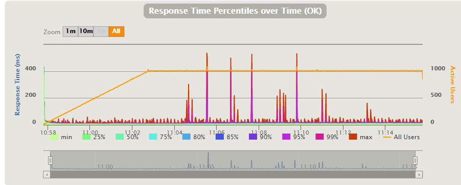

# Coordinator Avoidance Shard Allocation Strategy

## Summary

We face response time (latency) spikes during a rolling update in some specific situations with *Akka Cluster Sharding*.
This challenge is because we lose the `ShardCoordinator` and `ShardHome` cache simultaneously.
To address this challenge, we propose a custom shard allocation strategy.
The strategy avoids allocating `Shard`s to the oldest node hosting the `ShardCoordinator`.
We verified that the custom strategy prevents such latency spikes if we ensure all nodes cached all `ShardHome`s before shutting the oldest node.
The strategy reduces about 80% latency at stopping the oldest node.

## Motivation

One of the most excellent parts of *Akka* is *Akka Cluster Sharding*.
Akka Cluster Sharding remarks excellent performance in most cases.
However, in some specific situations, we will face room for improvement.
One of them is that we face response time (latency) spikes during a rolling update.
One of the most significant latency spikes occurs when we stop the oldest node that hosts the `ShardCoordinator`.

The latency spikes may vary depending on maximum `Shard`s and the number of cluster nodes.
The latency spikes may become significant in an environment where we have to use many `Shard`s per a node (such as 100 `Shard`s per node).
This situation is realistic.
Suppose we will handle elastic traffic (`daytime traffic / night time traffic` could be 10 ~ 100).
In such situation, we want to scale in/out based on traffic.
Suppose the maximum number of nodes is 30 and the minimum number of nodes is 3.
The optimal maximum number of `Shard`s is 300 (30 * 10).
Thus, in running with minimum number of nodes, each node has to host 100 `Shard`s.

Based on our research, the challenge is because we lose the `ShardCoordinator` and `ShardHome` cache simultaneously.
We have to pay a penalty of waiting for `ShardHome` resolutions until the `ShardCoordinator` will be available at new oldest node (the waiting time could be up to seconds).
If we avoid losing the `ShardCoordinator` and `ShardHome` cache simultaneously, we can achieve a chance to reduce the latency spikes.

## Proposal

By implementing a custom shard allocation strategy, we can avoid losing both the `ShardCoordinator` and `ShardHome` cache at the same time.
We call the custom strategy `CoordinatorAvoidanceShardAllocationStrategy`.
The custom strategy avoids allocating `Shard`s to the oldest node hosting the `ShardCoordinator`.

### Pros
* The strategy reduces the latency spikes when we stop the oldest node.
* The strategy could be effective on both graceful shutdown and accidentally crash.

### Cons
* We have to host extra nodes (basically, at least one node). The node hosts the `ShardCoordinator`, but no `Shard`s.
* Rebalance is not intelligent at this point of writing. The strategy may hand off the same `Shard` several times during rebalance.

### Limitations
This strategy is effective only where all nodes cached all `ShardHome`s before the oldest node shuts down.
Since there is no automatic guarantee that the conditions are met, it is hard to decide automatically whether all nodes cached all `ShardHome`s or not.
At this point of writing, we have to wait enough time to meet such conditions by random user requests.

### Settings
There are four settings of `CoordinatorAvoidanceShardAllocationStrategy`.

* `oldest-nodes-excluded-from-allocation`  
  * How many nodes the strategy should avoid allocating `Shard`s.
  * The older nodes have a higher priority to be excluded.
  * If we set this setting one, the strategy will avoid allocating `Shard`s to the oldest node.
  * If we set this setting two, the strategy will avoid allocating `Shard`s to the first-oldest node and the second-oldest node.
  * If we set this setting zero, the strategy will behave almost the same as `LeastShardAllocationStrategy`.
* `allocation-nodes-min-cap`
  * How many at least nodes the strategy must allocate `Shard`s.
  * This setting has precedence over `oldest-nodes-excluded-from-allocation`.
  * This setting must be greater than or equal to one.
* `rebalance-absolute-limit`
  * How many `Shard`s the strategy rebalances at one time (absolute limit value).
* `rebalance-relative-limit`
  * How many `Shard`s the strategy rebalances at one time (relative limit value).

## Static Analysis

### What about a relationship between stable shard allocations and settings?

The strategy must allocate `Shard`s to at least one node using any settings.
The following table shows a relationship between shard allocations and settings.

| `oldest-nodes-excluded-from-allocation` | `allocation-nodes-min-cap` | The number of nodes in a cluster | The number of nodes that the strategy allocates `Shard`s |
|-----------------------------------------|----------------------------|----------------------------------|----------------------------------------------------------|
| 0                                       | 1                          | 1                                | 1                                                        |
| 0                                       | 1                          | 2                                | 2                                                        |
| 0                                       | 1                          | 3                                | 3                                                        |
| -                                       | -                          | -                                | -                                                        |
| 1                                       | 1                          | 1                                | 1                                                        |
| 1                                       | 1                          | 2                                | 1                                                        |
| 1                                       | 1                          | 3                                | 2                                                        |
| -                                       | -                          | -                                | -                                                        |
| 1                                       | 2                          | 1                                | 1                                                        |
| 1                                       | 2                          | 2                                | 2                                                        |
| 1                                       | 2                          | 3                                | 2                                                        |
| 1                                       | 2                          | 4                                | 3                                                        |
| -                                       | -                          | -                                | -                                                        |
| 2                                       | 1                          | 1                                | 1                                                        |
| 2                                       | 1                          | 2                                | 1                                                        |
| 2                                       | 1                          | 3                                | 1                                                        |
| 2                                       | 1                          | 4                                | 2                                                        |
| 2                                       | 1                          | 5                                | 3                                                        |
| -                                       | -                          | -                                | -                                                        |
| 2                                       | 2                          | 1                                | 1                                                        |
| 2                                       | 2                          | 2                                | 2                                                        |
| 2                                       | 2                          | 3                                | 2                                                        |
| 2                                       | 2                          | 4                                | 2                                                        |
| 2                                       | 2                          | 5                                | 3                                                        |

### What about stable shard allocations during a rolling update?

The following table shows a stable shard allocations transition during a rolling update when the strategy uses the following settings.
* `oldest-nodes-excluded-from-allocation = 1`
* `allocation-nodes-min-cap = 1`

| state        | old-1 | old-2 | old-3 | old-4 | new-1 | new-2 | new-3 | new-4 |
|--------------|-------|-------|-------|-------|-------|-------|-------|-------|
| initial      | 100   | 100   | 100   | 0     | -     | -     | -     | -     |
| launch new-1 | 100   | 100   | 100   | 0     | 0     | -     | -     | -     |
| stable       | 75    | 75    | 75    | 0     | 75    | -     | -     | -     |
| stop old-1   | -     | 75    | 75    | 0     | 75    | -     | -     | -     |
| stable       | -     | 100   | 100   | 0     | 100   | -     | -     | -     |
| launch new-2 | -     | 100   | 100   | 0     | 100   | 0     | -     | -     |
| stable       | -     | 75    | 75    | 0     | 75    | 75    | -     | -     |
| stop old-2   | -     | -     | 75    | 0     | 75    | 75    | -     | -     |
| stable       | -     | -     | 100   | 0     | 100   | 100   | -     | -     |
| launch new-3 | -     | -     | 100   | 0     | 100   | 100   | 0     | -     |
| stable       | -     | -     | 75    | 0     | 75    | 75    | 75    | -     |
| stop old-3   | -     | -     | -     | 0     | 75    | 75    | 75    | -     |
| stable       | -     | -     | -     | 0     | 100   | 100   | 100   | -     |
| launch new-4 | -     | -     | -     | 0     | 100   | 100   | 100   | 0     |
| stable       | -     | -     | -     | 0     | 75    | 75    | 75    | 75    |
| stop old-4   | -     | -     | -     | -     | 75    | 75    | 75    | 75    |
| stable       | -     | -     | -     | -     | 0     | 100   | 100   | 100   |

Legend
* Each column shows how many `Shard`s a node has.
* Each row shows states during a rolling update.
* `-` means a node stopped.
* `old-4` is the oldest node. The node has the `ShardCoordinator` before a rolling update.
* `new-1` is the new oldest node. The node has the `ShardCoordinator` after a rolling update.

### Why is `oldest-nodes-excluded-from-allocation` configurable?

It would be enough to set `oldest-nodes-excluded-from-allocation` to one in most cases.
This setting is a safe margin for the oldest node crash.
Suppose, in a short period, the first-oldest node crashes and then the second-oldest node crashes.
`CoordinatorAvoidanceShardAllocationStrategy` works well when the first-oldest node crashes since we don't lose the `ShardCoordinator` and `Shard`s simultaneously.
After the first-oldest node crashed but before the second-oldest node crashes, until a rebalance completes, we have the second-oldest node (at this point, this is already the oldest node) hosting both the `ShardCoordinator` and `Shard`s.
If the node crashes before the rebalance completes, we lose the `ShardCoordinator` and `Shard`s simultaneously.
The node crash could cause latency spikes we want to prevent.
We can avoid this scenario if the strategy allocates no shards to both the first-oldest node and the second-oldest node (This is when we set `oldest-nodes-excluded-from-allocation` to two).

### Why is there `allocation-nodes-min-cap`?

This setting is a guarantee the strategy allocates `Shard`s to nodes until our cluster has enough nodes.
This setting might be effective when we have few nodes after a cluster disaster.
It may rarely happen, but it may happen.

## Experiments

We have experimented `LeastShardAllocationStrategy` and `CoordinatorAvoidanceShardAllocationStrategy`.
We executed a rolling update against 4-nodes-cluster.
Our rolling update was performed by a handmade shell script.
The following table shows events we scheduled by the script.

| Time | Event                                |
|------|--------------------------------------|
| 8m   | Start new app No. 1                  |
| 9m   | Stop old app No. 1                   |
| 10m  | Start new app No. 2                  |
| 11m  | Stop old app No. 2                   |
| 12m  | Start new app No. 3                  |
| 13m  | Stop old app No. 3                   |
| 14m  | Start new app No. 4                  |
| 16m  | Stop old app No. 4 (the oldest node) |

We use Akka [`2.6.15+3-ebbb1a17-SNAPSHOT`](https://oss.sonatype.org/content/repositories/snapshots/com/typesafe/akka/akka-cluster-sharding_2.13/2.6.15+3-ebbb1a17-SNAPSHOT/).
This version contains an improvement([sharding: actively signal 'region stopped' to the coordinator by raboof · Pull Request #30402 · akka/akka](https://github.com/akka/akka/pull/30402)) that affects our results.

The following settings are used with both strategies.
- `akka.cluster.sharding.number-of-shards = 300`
- `akka.cluster.sharding.passivate-idle-entity-after = 3m`
- `akka.cluster.sharding.coordinator-state.read-majority-plus = 0`  
  Until the Pull Request [Exclude exiting members in Read/Write MajorityPlus, #30327 by patriknw · Pull Request #30328 · akka/akka](https://github.com/akka/akka/pull/30328) is merged, it's great to set this setting to zero with a small cluster.
- `akka.cluster.sharding.distributed-data.majority-min-cap = 2`  
  It's great to set this setting explicitly with a small cluster.
- `akka.cluster.sharding.rebalance-interval = 10s`

### `LeastShardAllocationStrategy`
Here are the settings of `LeastShardAllocationStrategy` we used.
Since we set `akka.cluster.app-version` nodes appropriately, `LeastShardAllocationStrategy` does not rebalance during a rolling update.
However, it may be worth denoting the following settings.
* `rebalance-absolute-limit = 30`
  * The strategy can rebalance at most 30 `Shard`s at one time.
* `rebalance-relative-limit = 0.1`
  - The strategy can rebalance at most 10% `Shard`s at one time.

The following figures are results of `LeastShardAllocationStrategy`.

From the above results, we can observe latency spikes (*around 3100ms ~ 3200ms*) when we stop the oldest node.

### `CoordinatorAvoidanceShardAllocationStrategy`
Here are the settings of `CoordinatorAvoidanceShardAllocationStrategy` we used.

* `oldest-nodes-excluded-from-allocation = 1`  
  * The strategy should avoid allocating `Shard`s to the oldest node.
* `allocation-nodes-min-cap = 1`
  * The strategy must allocate `Shard`s to at least one node.
* `rebalance-absolute-limit = 30`
  * The strategy can rebalance at most 30 `Shard`s at one time.
* `rebalance-relative-limit = 0.1`
  * The strategy can rebalance at most 10% `Shard`s at one time.

The following figures are results of `CoordinatorAvoidanceShardAllocationStrategy`.
Note that the scale on the vertical axis is different from the previous results.

From the above results, we can say that `CoordinatorAvoidanceShardAllocationStrategy` performs excellently in the situation.
We can mitigate the latency spikes to around *200ms ~ 500ms* when we stop the oldest node. 
Both strategies remark around *500ms ~ 600ms* as the latency when we stop old nodes except the oldest.

## Further Challenges

### Efficient Shard Allocation during a rolling update
We can achieve efficient shard allocation during a rolling update by using the `akka.cluster.app-version` (the setting is public, but the *Scala* and *Java* API is private at this point of writing).
It might be great not to depend on such APIs if we provide the strategy as a third-party library.
The limitation might be relatively easy to resolve by integrating this strategy into *Akka* or making the API public.

### Automatic ShardHome cache guarantee
At this point of writing, there is no automatic guarantee that all nodes cached all `ShardHome`s.
There might be some way to achieve the guarantee.
One of them is that the `ShardCoordinator` distributes `ShardHome` cache to each `ShardRegion` actively.
